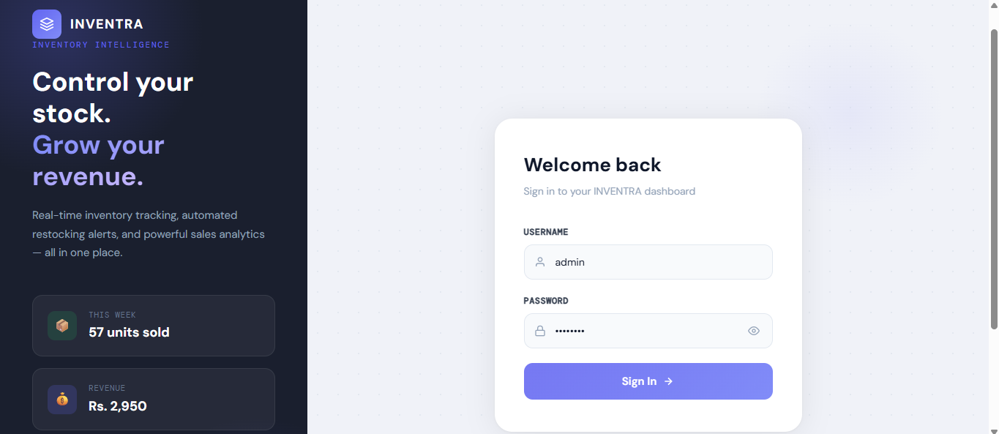
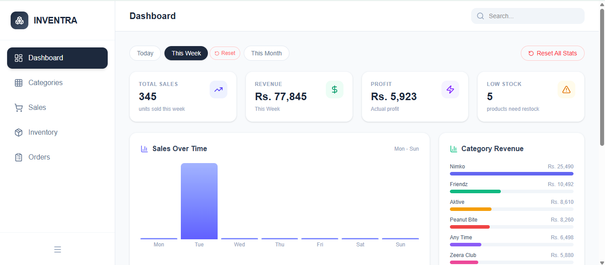
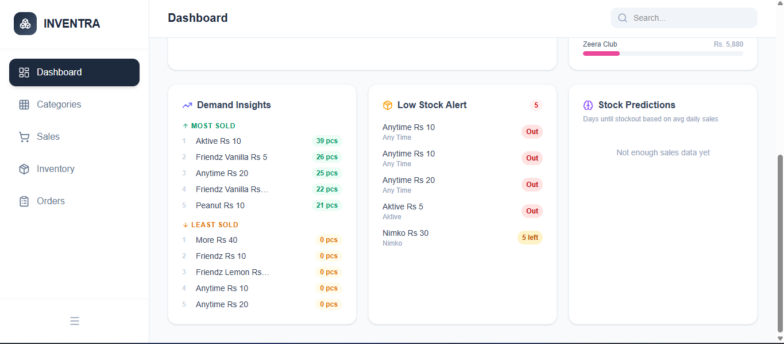
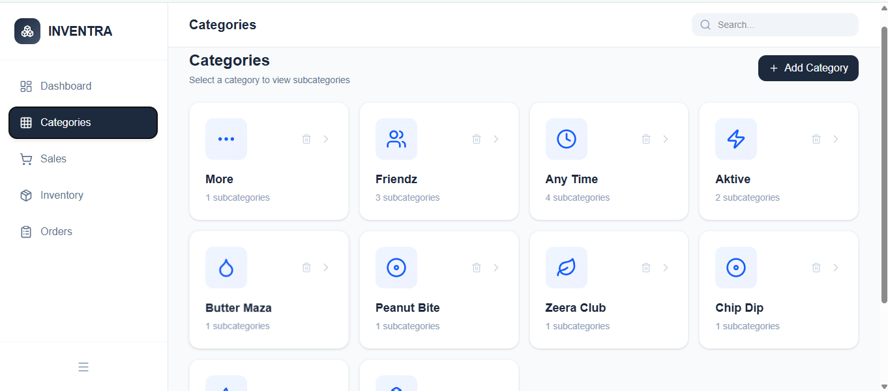
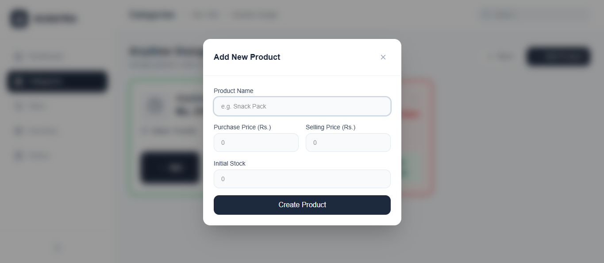
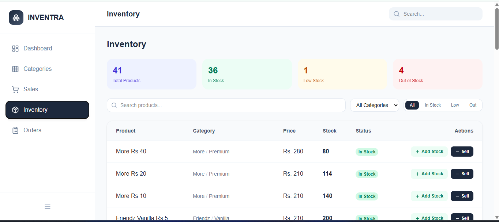
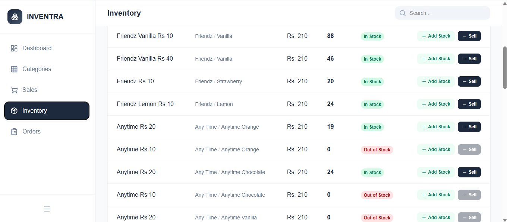
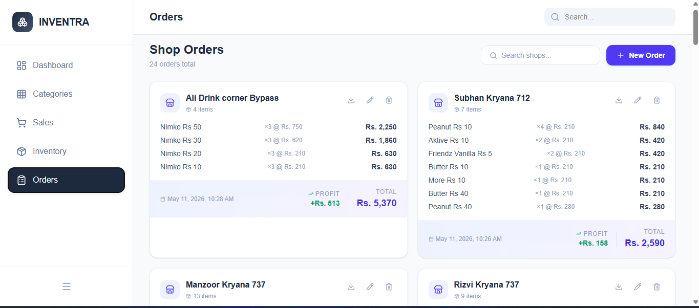
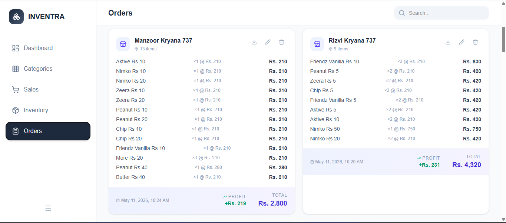

# Inventra

Inventra is a comprehensive, modern inventory and sales management application tailored for small shops, retail businesses, and wholesalers. It offers an intuitive, seamlessly animated interface to deeply organize products, track real-time stock levels, record both retail sales and wholesale orders, and calculate live profit margins. 

With built-in analytics, intelligent stock alerts, date-based filtering, and automated PDF reporting, Inventra reduces the friction of daily operational management into a single, clean dashboard securely backed by Supabase.

## Comprehensive Feature List

### 📦 Inventory & Catalog Management
- **Deep Organization:** Group items logically through a Category > Subcategory > Product structure.
- **Dynamic Icons:** Auto-generated visual icons for categories and products based on their names.
- **Inline Editing:** Instantly rename categories, subcategories, and products. Quick edits for selling price, purchase (cost) price, and existing stock.
- **Live Profit Preview:** Shows exact profit-per-unit and margin percentages as you set product prices.
- **Intelligent Stock Badges:** Visual indicators (`In Stock`, `Low Stock`, `Out of Stock`) to easily spot inventory issues.
- **Add Stock & Sell Actions:** Quick-action buttons directly on product cards for routine operations without navigating away.

### 💰 Sales & Order Tracking
- **Unified Transactions View:** See retail transactions and large-scale wholesale / shop orders side-by-side.
- **Inline Modifications:** Update or adjust previously recorded sales directly from the log.
- **Date Filtering:** Custom `From` and `To` date pickers to view sales history over specific periods.
- **Profit Tracking:** Automatically calculates totals and net profits per transaction based on current cost properties.

### 📊 Dashboard & Analytics
- **At-a-Glance Metrics:** View total products in inventory, total categories, and quick numbers directly on the primary dashboard.
- **Daily Sales PDF Report:** Generate printable PDF reports for daily closures directly from the sales view.

### 🎨 UI & UX
- **Beautiful & Modern:** Built with Tailwind CSS and Framer Motion for buttery-smooth animations and transitions.
- **Responsive Layout:** Works effortlessly across devices with expandable/collapsible sidebars and mobile-optimized grids.
- **Non-destructive Safeguards:** Prompt-based confirmations for critical destructive actions like cascading deletions.

## Tech Stack

- **Framework:** Next.js (App Router)
- **Library:** React + TypeScript
- **Styling & Animation:** Tailwind CSS + Framer Motion
- **Database / Backend:** Supabase (PostgreSQL)
- **Icons:** Lucide React

## Getting Started

1. Install dependencies:

```bash
npm install
```

2. Create a `.env.local` file and add your Supabase keys:

```bash
NEXT_PUBLIC_SUPABASE_URL=your_supabase_url
NEXT_PUBLIC_SUPABASE_ANON_KEY=your_supabase_anon_key
```

3. Start the dev server:

```bash
npm run dev
```

Open http://localhost:3000 to view the app.

## Screenshots










